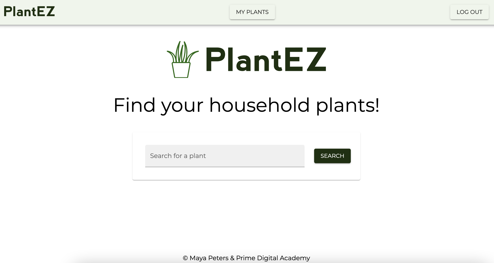
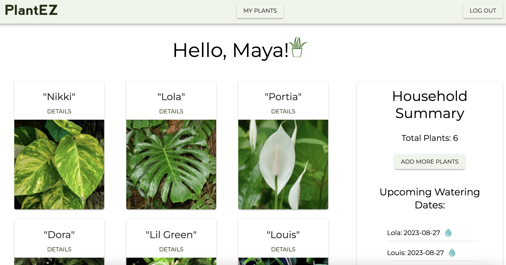
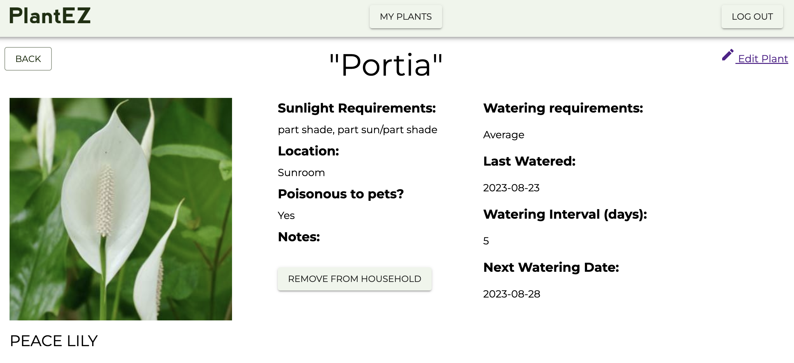

# PlantEZ

PlantEZ is a full stack web application which allows you to search for and save your household plants. You can customize and track your plant's watering schedules, find out if your plants are poisonous to pets, and make sure that each species is getting the correct amount of sun. Never kill your houseplants again! 

[Live app here!](https://plantez-b2407ef07622.herokuapp.com/#/home)

## Screenshots

### Homepage


### Household summary


### Plant detail page



## Getting Started

These instructions will get you a copy of the project up and running on your local machine for development and testing purposes. See deployment for notes on how to deploy the project on a live system.

### Prerequisites

In order to run this application on your machine, you will need to have the following installed on your computer:
* [Node.js](https://nodejs.org/en)
* [PostgreSQL](https://www.postgresql.org/)
* [Nodemon](https://nodemon.io/)

### Installing

First, make a fork or template of this repository and clone it down to your machine

Next, install all dependencies by running:

```
npm install
```

Create a `.env` file at the root of the project and paste this line into the file:
  ```
  SERVER_SESSION_SECRET=superDuperSecret
  ```
While you're in your new `.env` file, take the time to replace `superDuperSecret` with some long random string to keep your application secure. If you don't do this step, create a secret with less than eight characters, or leave it as `superDuperSecret`, you will get a warning.

Start postgres if not running already

Start the server by running:

```
npm run server
```

Open a new terminal tab and run the client:

```
npm run client
```
### Create database and table

Create a new database called `plantez`, and create `user` and `plants` tables

```SQL
CREATE TABLE "user" (
  "id" SERIAL PRIMARY KEY,
  "first_name" VARCHAR (80) NOT NULL,
  "last_name" VARCHAR (80) NOT NULL,
  "email" VARCHAR (80) UNIQUE NOT NULL,
  "password" VARCHAR (1000) NOT NULL
);
```

```SQL
CREATE TABLE "plants" (
	"id" SERIAL PRIMARY KEY,
	"nickname" VARCHAR (80) NOT NULL,
	"last_watered_date" DATE,
	"watering_interval" INT,
	"next_watering_date" DATE,
	"current_location" VARCHAR (1000),
	"notes" VARCHAR (1000),
	"image_url" VARCHAR (1000),
	"plant_api_id" integer NOT NULL,
	"user_id" integer REFERENCES "user"
);
```
## Production Build

Before pushing to Heroku, run `npm run build` in terminal. This will create a build folder that contains the code Heroku will be pointed at. You can test this build by typing `npm start`. Keep in mind that `npm start` will let you preview the production build but will **not** auto update.

## Deployment

1. Create a new Heroku project
1. Link the Heroku project to the project GitHub Repo
1. Create an Heroku Postgres database
1. Connect to the Heroku Postgres database from Postico
1. Create the necessary tables
1. Add an environment variable for `SERVER_SESSION_SECRET` with a nice random string for security
1. In the deploy section, select manual deploy

## Built With
* [Node.js](https://nodejs.org/en/)
* [Express](https://expressjs.com/)
* [React](https://react.dev/)
* [Redux](https://redux.js.org/)
* [Material UI](https://mui.com/)
* [Postgres](https://www.postgresql.org/)


## Authors

* **Prime Digital Academy** - *Setup user authentication* - [PrimeDigitalAcademy](https://github.com/PrimeAcademy)
* **Maya Peters** - *All additional features of PlantEZ app and styling* - [Mayaavida](https://github.com/mayaavida)


## Acknowledgments

* Thank you to my amazing instructors at Prime Digital Academy - Zac, Chris, and Peter 
* Thanks to my fellow students for all the support and assistance!
* Thank you to my partner for cooking almost every night all summer!
