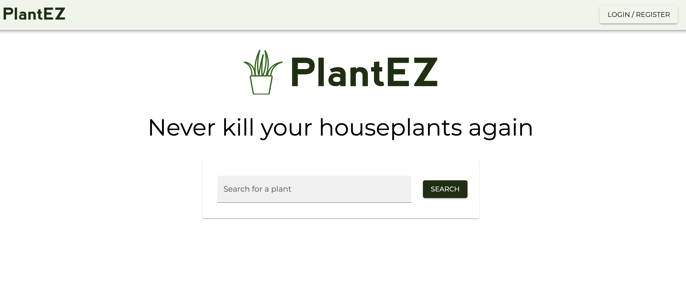

# PlantEZ

PlantEZ is a full stack web application which allows you to search for and save your household plants. You can customize and track your plant's watering schedules, find out if your plants are poisonous to pets, and make sure that each species is getting the correct amount of sun. Never kill your houseplants again! 



## Getting Started

These instructions will get you a copy of the project up and running on your local machine for development and testing purposes. See deployment for notes on how to deploy the project on a live system.

First, make a fork or template of this repository and clone it down to your machine

### Prerequisites

In order to run this application on your machine, you will need to have the following installed on your computer:
* [Node.js](https://nodejs.org/en)
* [PostgreSQL](https://www.postgresql.org/)
* [Nodemon](https://nodemon.io/)


### Create database and table

Create a new database called `plantez`, and create `user` and `plants` tables

```SQL
CREATE TABLE "user" (
  "id" SERIAL PRIMARY KEY,
  "first_name" VARCHAR (80) NOT NULL,
  "last_name" VARCHAR (80) NOT NULL,
  "email" VARCHAR (80) UNIQUE NOT NULL,
  "password" VARCHAR (1000) NOT NULL
);
```
```SQL
CREATE TABLE "plants" (
	"id" SERIAL PRIMARY KEY,
	"nickname" VARCHAR (80) NOT NULL,
	"last_watered_date" DATE,
	"watering_interval" INT,
	"next_watering_date" DATE,
	"current_location" VARCHAR (1000),
	"notes" VARCHAR (1000),
	"image_url" VARCHAR (1000),
	"plant_api_id" integer NOT NULL,
	"user_id" integer REFERENCES "user"
);
```

### Installing

First, fork this repo and clone down to your machine

Next, install all dependencies by running:

```
npm install
```

Create a `.env` file at the root of the project and paste this line into the file:
  ```
  SERVER_SESSION_SECRET=superDuperSecret
  ```
While you're in your new `.env` file, take the time to replace `superDuperSecret` with some long random string to keep your application secure. If you don't do this step, create a secret with less than eight characters, or leave it as `superDuperSecret`, you will get a warning.

Start postgres if not running already

Start the server by running:

```
npm run server
```

Open a new terminal tab and run the client:

```
npm run client
```

## Deployment

Add additional notes about how to deploy this on a live system

## Built With

* [Dropwizard](http://www.dropwizard.io/1.0.2/docs/) - The web framework used
* [Maven](https://maven.apache.org/) - Dependency Management
* [ROME](https://rometools.github.io/rome/) - Used to generate RSS Feeds

## Contributing

Please read [CONTRIBUTING.md](https://gist.github.com/PurpleBooth/b24679402957c63ec426) for details on our code of conduct, and the process for submitting pull requests to us.

## Versioning

We use [SemVer](http://semver.org/) for versioning. For the versions available, see the [tags on this repository](https://github.com/your/project/tags). 

## Authors

* **Billie Thompson** - *Initial work* - [PurpleBooth](https://github.com/PurpleBooth)

See also the list of [contributors](https://github.com/your/project/contributors) who participated in this project.

## License

This project is licensed under the MIT License - see the [LICENSE.md](LICENSE.md) file for details

## Acknowledgments

* Hat tip to anyone whose code was used
* Inspiration
* etc
